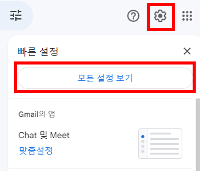
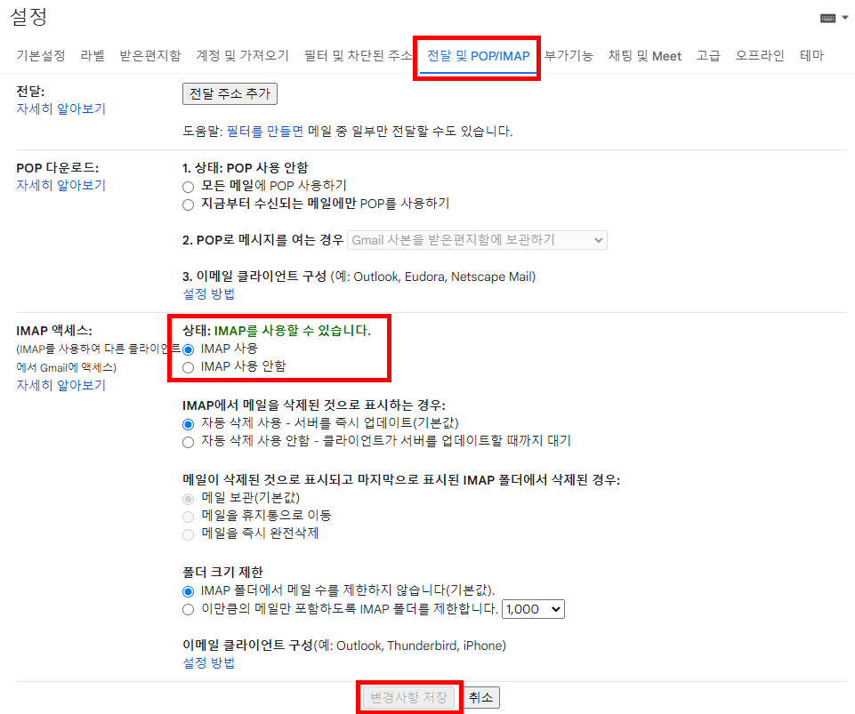

# SRT 예약하기

## 설치

1. python, Chrome<br/>
   python과 Chrome으로 동작하므로 둘 모두 설치되어 있어야 한다.

2. pip install<br/>
   ```bash
   pip install selenium
   pip install webdriver_manager
   ```
   <br/>

## 설정

1. settings.py 파일을 수정한다.
2. gmail 설정<br/>
   1. gmail 접속 후 우측 상단의 톱니바퀴 → 모든 설정 보기 클릭
      
   2. 전달 및 POP/IMAP → IMAP 사용 체크 → 변경사항 저장
      

<br/>

## 실행

1. main()함수의 FROM, TO, DATE, TIME을 형식에 맞게 입력한다.
2. searchTrain()함수의 while문 안에 있는 for문의 시작 숫자를 변경한다.<br/>
   ex) 첫번째부터 예매하고 싶다면 1, 세번째부터 예매하고 싶다면 3<br/>
   현재는 세번째부터 확인하도록 3으로 되어있다.
3. searchTrain()함수의 trainToCheckNum값을 원하는 값으로 변경한다.<br/>
   ex) 두개를 확인하고 싶다면 2
   현재는 3번째부터 2개를 확인할거라서 2로 되어있다.
4. `ReservationSRT.py`파일을 실행한다.

<br/>

## 설명

SRT가 예약되면 설정한 Gmail로 메일이 보내진다.
